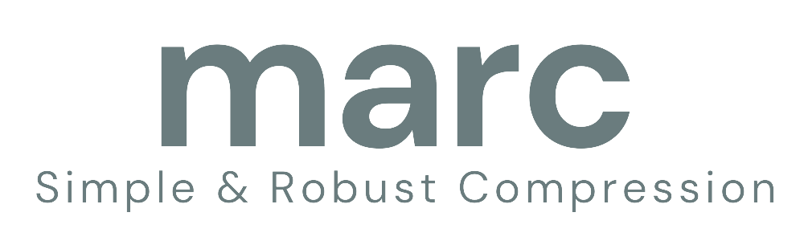

# marc


`marc` is a C++20 framework for independently designed, streaming lossless
compression components. The currently implemented public profiles are the
version 1 framed Blocked Huffman, Adaptive Huffman, Dynamic Range, rANS, tANS,
LZ77, LZ77 plus Blocked Huffman, LZSS, LZ78, LZW, LZD, and LZMW codecs, exposed
through a small C ABI. A version 1.1 raw framing profile with mandatory
per-frame CRC-32C is also available through its dedicated C ABI. The
format and API are still under development and version 0.x streams are not yet
promised long-term compatibility.

The [documentation index](docs/README.md) separates library and format guides
from validation material and chronological implementation records.

## Build

Initialize the compiler environment, then use the repository presets:

```console
cmake --preset windows-msvc
cmake --build --preset windows-msvc-debug
ctest --preset windows-msvc-debug
```

Windows uses the Visual Studio generator and MSBuild. The portable presets use
Ninja on non-Windows hosts. GoogleTest is needed only when `MARC_BUILD_TESTS` is
enabled; initialize the pinned submodule with:

```console
git submodule update --init --recursive
```

## Command-line tool

Top-level builds produce a small `marc` executable that exercises the public C
ABI with bounded streaming buffers. LZ77 variant 1 is the default profile:

```console
marc encode input.bin output.marc
marc decode output.marc restored.bin
marc encode --codec blocked-huffman input.bin output.marc
marc decode --codec blocked-huffman output.marc restored.bin
```

See the [command-line reference](docs/cli.md) for all profiles and file/error
behavior.

## CMake consumption

An installed package exports whichever libraries were enabled when marc was
built:

```cmake
find_package(marc CONFIG REQUIRED)
target_link_libraries(my_program PRIVATE marc::shared) # or marc::static
```

## Benchmarks

Set `MARC_BUILD_BENCHMARKS=ON` in an optimized build to produce
`marc_benchmark`. It reports canonical compression ratio, encode/decode MiB/s,
and peak caller-owned codec workspace for checksum-raw, standalone Blocked
Huffman, Adaptive Huffman, Dynamic Range, rANS, tANS, LZ77, LZ77 plus Blocked
Huffman, LZSS, LZ78, LZW, LZD, or LZMW.
See
[`docs/benchmarks.md`](docs/benchmarks.md) for the measurement contract.

## Fuzzing

Set `MARC_BUILD_FUZZERS=ON` in a separate Clang/LLVM sanitizer build to produce
bounded stream-decoder fuzz targets for all public standalone codec profiles,
the composed LZ77 plus Blocked Huffman profile, and checksum-raw. Build and
corpus instructions are in [`docs/fuzzing.md`](docs/fuzzing.md).

## Interoperability

Successful Windows and Ubuntu CI jobs publish deterministic archive bundles for
external platform checks. See
[`docs/interoperability.md`](docs/interoperability.md) for download, verification,
and result-reporting instructions.
The current local-versus-release status of every baseline codec is summarized
in [`docs/baseline-readiness.md`](docs/baseline-readiness.md).

The standalone project in `examples/` demonstrates installed-package use. See
[`docs/c-api.md`](docs/c-api.md) for the C transform lifecycle and
[`docs/format.md`](docs/format.md) for the current byte representation.

## License and provenance

The repository is MIT licensed. Its implementation process is described as a
specification-driven independent implementation; provenance and intentionally
unconsulted implementation sources are recorded in
[`docs/implementation/clean-room-record.md`](docs/implementation/clean-room-record.md).
This process is not a legal guarantee of non-infringement.
